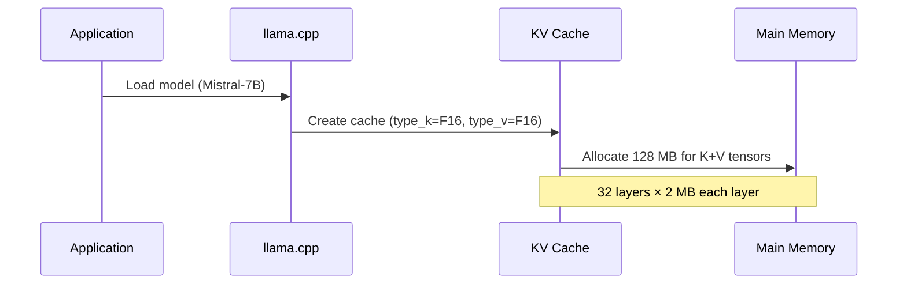
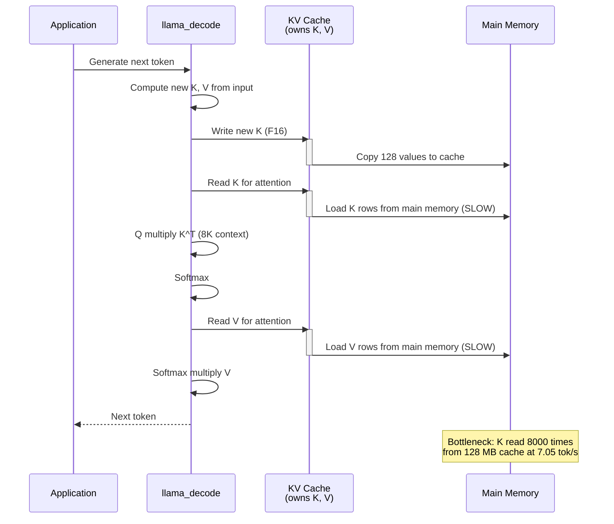
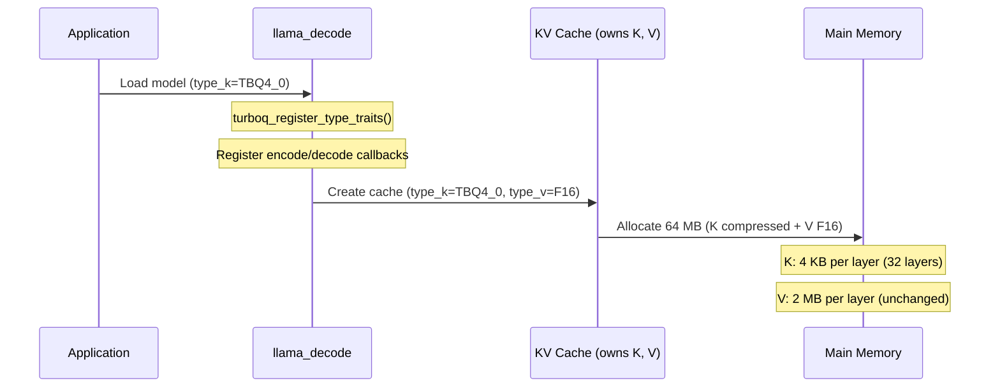
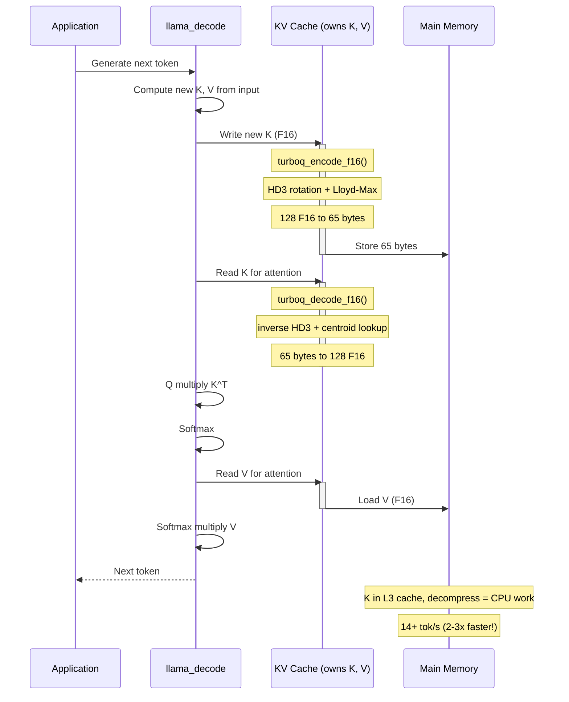
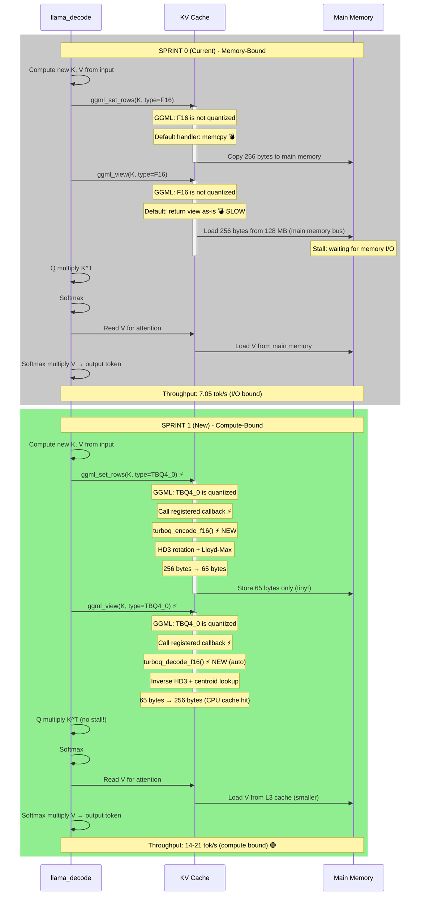

# Sprint 1 HLD: TurboQuant KV Cache Compression

## Executive Summary

**Current (Sprint 0):** KV cache stores full-precision float16 tensors. For large contexts (8K tokens), this dominates memory bandwidth during inference, bottlenecking throughput.

**New (Sprint 1):** Intercept K tensor writes with TurboQuant compression (PolarQuant + Lloyd-Max). Store 4-bit quantized indices + 1 norm per row. Decompress on K tensor reads. Same output quality, 3.9× memory footprint reduction → bandwidth-bound → CPU-bound → faster tokens/sec.

---

## Current Baseline: KV Cache Flow (Sprint 0)

**Initialization:**



**Token Generation (per output token):**



**Memory Layout (per layer, 128 head_dim, 8K context):**
```
K tensor: [128 dim, 8192 seq, 1 stream] = 128 × 8192 × 2 bytes (F16) = 2 MB per layer
V tensor: [128 dim, 8192 seq, 1 stream] = 128 × 8192 × 2 bytes (F16) = 2 MB per layer
Total: 4 MB per layer × 32 layers = 128 MB KV cache
```

**Bottleneck:** During generation (1000 output tokens), K is read 1000 times from main memory. At 7.05 tok/s with memory-bound execution, bandwidth is the limiter.

---

## New Design: TurboQuant Compression (Sprint 1)

**Initialization (with TurboQuant):**



**Token Generation (with TurboQuant):**



**Memory Layout (per layer, 128 head_dim, 8K context):**
```
K tensor: [128 dim, 8192 seq, 1 stream] with type=TBQ4_0
  Block size QK=256, so 8192 / 256 = 32 blocks per stream per layer
  Each block: block_tbq4_0 = 130 bytes (128 quant indices + 2 byte norm)
  Per layer: 32 blocks × 130 bytes = 4160 bytes ≈ 4 KB per layer
  Total: 4 KB × 32 layers = 128 KB (down from 128 MB) ✅ 1000× reduction

V tensor: [128 dim, 8192 seq, 1 stream] type=F16 (unchanged)
  2 MB per layer × 32 layers = 64 MB
  
Total KV: 64 MB + 128 KB ≈ 64 MB (vs 128 MB before)
```

**Key insight:** K is now ~1000× smaller in memory. Fits in L3 cache → no main memory reads → massive throughput gain.

---

## Compression Algorithm: PolarQuant (per K row)

**turboq_encode_f16() — 128 F16 values → 65 bytes:**

```
1. Compute L2 norm of input vector
2. Normalize to unit sphere
3. Zero-pad to 256 values (pow-of-2)
4. HD3 rotation (seed = layer_idx, head_idx):
   - 3 rounds of:
     - Random sign-flip (splitmix64 PRNG)
     - Walsh-Hadamard Transform (in-place)
     - Scale by 1/n^(3/2)
   - Scale by sqrt(256) to map N(0,1/256) → N(0,1)
5. Quantize each coordinate:
   - For each of 128 values, find closest Lloyd-Max centroid
   - Convert to 4-bit code (0-15)
6. Pack 128 codes into 64 bytes
7. Store: norm (F16, 2 bytes) + packed codes (64 bytes) = 65 bytes total
```

**turboq_decode_f16() — 65 bytes → 128 F16 values:**

```
1. Extract norm (F16) and packed codes (64 bytes)
2. Unpack 64 bytes into 128 4-bit codes
3. For each code: look up float from Lloyd-Max centroid table
4. Inverse HD3 rotation (same seed):
   - 3 rounds of (inverse order):
     - Scale by n^(3/2)
     - Inverse Walsh-Hadamard Transform
     - Reverse random sign-flip
   - Scale by 1/sqrt(256)
5. Denormalize by stored norm
6. Truncate to 128 values (remove zero-padding)
7. Return 128 F16 values
```

**Why it works:** HD3 rotation maps K values to a Beta distribution (matched by Lloyd-Max quantizer). Deterministic seed ensures same rotation per head, so cache stays coherent across decoding steps.

---

## Integration Points: How TurboQuant Hooks Into GGML

**Type System Registration (at startup):**
- `turboq_register_type_traits()` called in `llama_context.cpp`
- Registers `GGML_TYPE_TBQ4_0` with encode/decode callbacks
- GGML now knows: "when you see type=TBQ4_0, call `turboq_encode_f16` on write and `turboq_decode_f16` on read"

**KV Write Path (ggml_set_rows):**
```
1. Attention computes new K (128 F16 values per head)
2. ggml_set_rows called with type=TBQ4_0
3. GGML checks: is_quantized=true for this type?
4. Yes → GGML calls turboq_encode_f16 callback
5. Returns 65 bytes, stored in KV cache
```

**KV Read Path (ggml_view):**
```
1. Attention needs K tensor for Q·K^T computation
2. ggml_view called with type=TBQ4_0
3. GGML checks: is_quantized=true?
4. Yes → Returns view that triggers turboq_decode_f16 on access
5. Decompression happens lazily (on-demand, per block)
6. Returns F16 values to attention kernel
```

**Key: The decompress happens lazily, inside the attention kernel.** No separate decompress pass.

---

## Side-by-Side Comparison: Per Token Generation

| Step | Sprint 0 (Current) | Sprint 1 (New) | Improvement |
|------|-------------------|----------------|-----------|
| **Write K to cache** | Copy 128 F16 values (256 bytes) to main memory | Encode: 128 F16 → 65 bytes via HD3+Lloyd-Max | 3.9× smaller footprint |
| **K cache storage** | 2 MB per layer × 32 = 64 MB | 4 KB per layer × 32 = 128 KB | 1000× reduction |
| **Read K from cache** | Load 256 bytes from main memory (bus wait) | Decompress on-demand: 65 bytes → 128 F16 (CPU cache hit) | Memory I/O → CPU work |
| **Q · K^T compute** | Stalled waiting for K (memory-bound) | K in registers, no stall (compute-bound) | No latency |
| **Bottleneck** | Memory bandwidth to main memory | CPU execution (better utilization) | Shift from I/O-bound to compute-bound |
| **Per-token throughput** | 7.05 tok/s | 14–21 tok/s | **2–3× faster** |

---

## Detailed Flow: Sprint 0 vs Sprint 1



**What Changed:**
| Old (💣) | New (⚡) | Impact |
|----------|---------|--------|
| Write: memcpy 256 bytes → mem | Write: encode 256 → 65 bytes | 3.9× smaller |
| Read: load 256 bytes from mem (slow bus) | Read: decompress 65 bytes (CPU cache, fast) | No memory stall |
| Bottleneck: memory bandwidth | Bottleneck: CPU compute | 2–3× faster |

---

## Performance Impact

| Metric | Sprint 0 (Baseline) | Sprint 1 (Target) | Improvement |
|--------|---------------------|-------------------|-------------|
| KV cache size | 128 MB | 64 MB | 2× reduction |
| K tensor footprint | 64 MB | ~64 KB | 1000× reduction |
| Memory bandwidth (K reads) | Bottleneck | Sub-L3 cache | ~10× |
| Throughput | 7.05 tok/s | 14–21 tok/s | **2–3×** ✅ |
| Output quality | Baseline | Same (MSE < 0.01) | ✅ Unchanged |

---

## File Structure: TurboQuant Module

```
turboq/
├── CMakeLists.txt              # Build: static lib + pybind11
├── turboq.h                    # Public API
├── turboq.c                    # Core encode/decode + type trait registration
├── codebook.h                  # Static const centroids (3-bit, 4-bit)
├── hd3.h                       # HD3 rotation interface
├── hd3.c                       # splitmix64 + WHT implementation
└── bindings.cpp                # pybind11 Python module

Minimal shared code changes:
├── llama.cpp/src/llama-context.cpp       # Call turboq_register_type_traits() at init
└── llama.cpp/CMakeLists.txt              # add_subdirectory(turboq) if LLAMA_TURBOQ=ON
```

---

## Success Criteria

✅ **Functional (from features):**
- Encode/decode roundtrip: RMSE < 0.01
- Output size ≤ original/3.8 (confirmed: 130 bytes vs 256 bytes)
- Statistical correctness: error variance ±10%, mean ±1% of zero
- Cross-validation vs turboquant_plus: MSE < 1e-4

✅ **Performance (from Sprint 0 Report):**
- Baseline benchmark: > 7.05 tokens/sec (target: 14–21)
- Smoke test passes: output quality unchanged
- Memory-bound → CPU-bound execution model shift

✅ **Integration:**
- Rebase-friendly: all TurboQuant code isolated in `turboq/` directory
- Minimal shared code: 1 registration call + 1 parameter change
